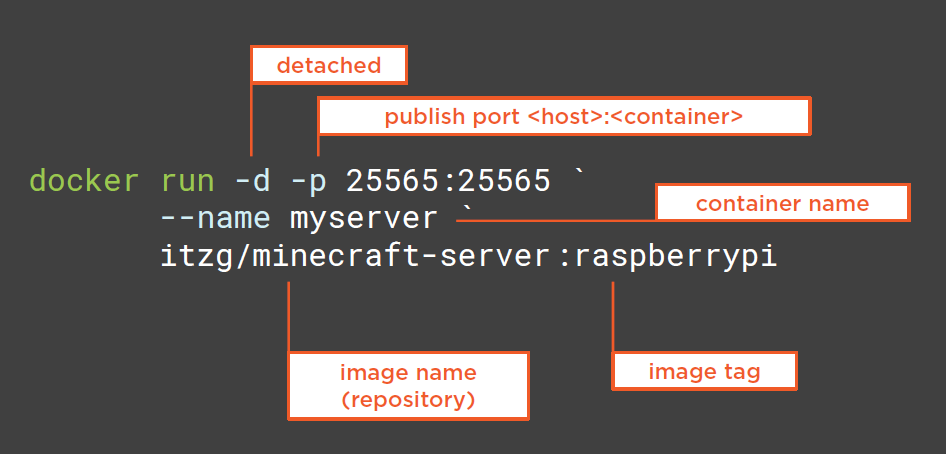
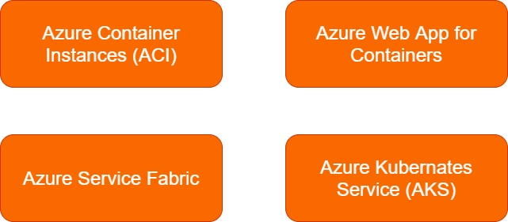

# Docker
 
Docker commands

## Table of Contents

- [Sending Feedback](#sending-feedback)
- [About Docker](#about-entity-framework-core)
- [Installing docker](#sample-application-with-each-steps)
    - [Desktop for windows](#desktop-for-windows)
    - [Visual studio extension](#visual-studio-extension)
    - [Check status/info of docker](#check-statusinfo-of-docker)
- [Running container locally](#running-container-locally)
    - [Docker run](#docker-run)
    - [List containers](#docker-run)
    - [Docker logs](#docker-run)
    - [Docker run](#docker-run)
    - [Docker images downloaded](#docker-images-downloaded)
    - [Docker Exec](#docker-Exec])
    - [Storing container data](#storing-container-data)
    - [Summary](#summary])
- [Creating docker images](#)
    - [Docker run](#docker-run)

## About docker


## Installing Docker

### Desktop for windows

[Install Docker Desktop for Windows](https://docs.docker.com/docker-for-windows/install/)

### Visual studio extension

[VS Market place](https://marketplace.visualstudio.com/items?itemName=ms-azuretools.vscode-docker)

[VS code extension](https://code.visualstudio.com/docs/containers/overview)

### Check status/info of docker

```sh
docker version
docker info
docker --help
```

## Running container locally

Example of running redis container locally 

### Docker run 



Download from image and running redis image locally

```sh
docker run -d -p 6379:6379 --name redis1 redis
```

### List containers

To check status of container list availabe locally

```sh
docker ps
```

### Docker logs

Logs output

```sh
docker logs redis1
```

### Docker images downloaded

List of all docker images downloaded

```ps
docker image ls
```

### Docker Exec

running inside redis container

```ps
docker exec -it redis1 sh
# redis-cli
120.0.0.1:6379> ping
PONG
120.0.0.1:6379> set name amit
OK
120.0.0.1:6379> get name
"amit"
120.0.0.1:6379> incr counter
(interger) 1
120.0.0.1:6379> incr counter
(interger) 2
120.0.0.1:6379> get counter
"2"
120.0.0.1:6379> exit
# exit
```

running redis with different container and attaching to first container

```ps
docker run -it --rm --link redis1:redis --name client1 redis sh
# redis-cli -h redis
redis:6379> get name
"amit"
redis:6379> get counter
"2"
redis:6379> exit
# exit
```

list of containers

```sh
docker ps
```

stopping container

```sh
docker stop redis1
```

now redis container will not shown

```sh
docker ps
```

to display redis container inactive status

```sh
docker ps -a
```

to remove container, but only images will remanin

```sh
docker rm redis1
```

to see docker images

```ps
docker image ls
```

to delete images

```ps
docker image rm redis
```

### Storing container data

```ps
docker run -d -p 5432:5432 -v postgres-data:/var/lib/postgresql/data --name postgres1 postgres -e POSTGRES_PASSWORD=password
```

run in container 

```ps
docker exec -it postgres1 sh
# createdb -U postgres mydb
# psql -U postgres mydb
psql (10.5 (Debian 10.5-1.pgdg90+1))
Type "help" for help.

mydb=# CREATE TABLE people (id int, name varch(50));
CREATE TABLE
mydb=# INSERT INTO people (id, name) VALUES (1, 'AMIT');
INSERT 0 1
mydb=# \Q
# exit
```

force stop /delete container

```ps
docker rm -f postgres1
```

list of volumes

```ps
docker volume ls
```

create another container with differenet container name as postgres2

```ps
docker run -d -p 5432:5432 -v postgres-data:/var/lib/postgresql/data --name postgres2 postgres -e POSTGRES_PASSWORD=password
```

run in container 

```ps1
docker exec -it postgres2 sh
# psql -U postgres mydb
psql (10.5 (Debian 10.5-1.pgdg90+1))
Type "help" for help.

mydb=# SELECT * FROM people;
id  |   name
----+-------
 1  |   amit

mydb=# \q
# exit
```

force stop /delete container

```ps
docker rm -f postgres2
```

delete volume

```ps
docker volume rm postgres-data
```

### Summary

* docker run 
    * -d (run detached)
    * -it (interactive terminal)
    * -p (publish a port)
    * -v (mount a volume)
    * --name (name of container)
    * --link (communicate between containers)
    * --rm (auto delete when container stops)
    * -e NAME=value (environment variables)
* docker exec
    * run command inside a container
* docker ps
    * see what containers are running
* docker logs
    * view log output from container
* clean up
    * docker rm -f container-name
    * docker image rm image-name
    * docker volume rm volume-name    

## Creating docker images

Dockerfile
- contains instructions for how to create a Docker image

```dockerfile
FROM mcr.microsoft.com/dotnet/sdk:5.0 AS build-env
WORKDIR /app
COPY ./out .
ENTRYPOINT ["dotnet", "samplewebapp.dll"]
```

or right click project > add docker support from visual studio

### Creating docker files

build docker image from docker file

```sh
docker build -t samplewebapp .
```

check for image

```sh
docker image ls
```

run container locally and redirect to localhost:8080

```sh
docker run -d -p 8080:80 --name myapp samplewebapp
```

to stop
```sh
docker rm -f myapp
```

### Multi stage docker files

incase of specific docker file

```sh
docker build -t samplewebapp:v2 -f mulit-stage.dockerfile .
```

### Container registries

```ps1
# before you begin - make sure you're logged in to the azure CLI
az login

# ensure you choose the correct azure subscription if you have more than one 
az account set -s YourSub

# create a resource group
$resourceGroup = "rg-services-shared-001"
az group create -n $resourceGroup -l westeurope

# create a new Azure container registry
# IMPORTANT - use your own name here - it must be unique
$registryName = "acrnavigatorprod001"
az acr create -g $resourceGroup -n $registryName --sku Basic

# log in to our container registry
az acr login -n $registryName

# get the login server name
$loginServer = az acr show -n $registryName `
    --query loginServer --output tsv
# OR: az acr list -g $resourceGroup -q "[].{acrLoginServer:loginServer}" -o table

# see the images we have - should have samplewebapp:v2
docker image ls

# give it a new tag
docker tag samplewebapp:v2 $loginServer/samplewebapp:v2

# push the image to our Azure Container Registry
docker push $loginServer/samplewebapp:v2

# view the images in our ACR
az acr repository list -n $registryName -o table

# view the tags for the samplewebapp repository
az acr repository show-tags -n $registryName --repository samplewebapp -o table

# delete a repository from the container registry
az acr repository delete -n $registryName -t samplewebapp:v2

# to delete everything we made in this demo
az group delete -n $resourceGroup
```
### 

## Various way to run container in azure



### Azure Container Instances (ACI)

* The quickest and easiest way to run a container in Azure
* "Serverless" you don't need to provision infrastructure
* Pay only while your container is running
    * Per-second billing model

## Reference

[docker cli docs](https://docs.docker.com/engine/reference/commandline/images/)
